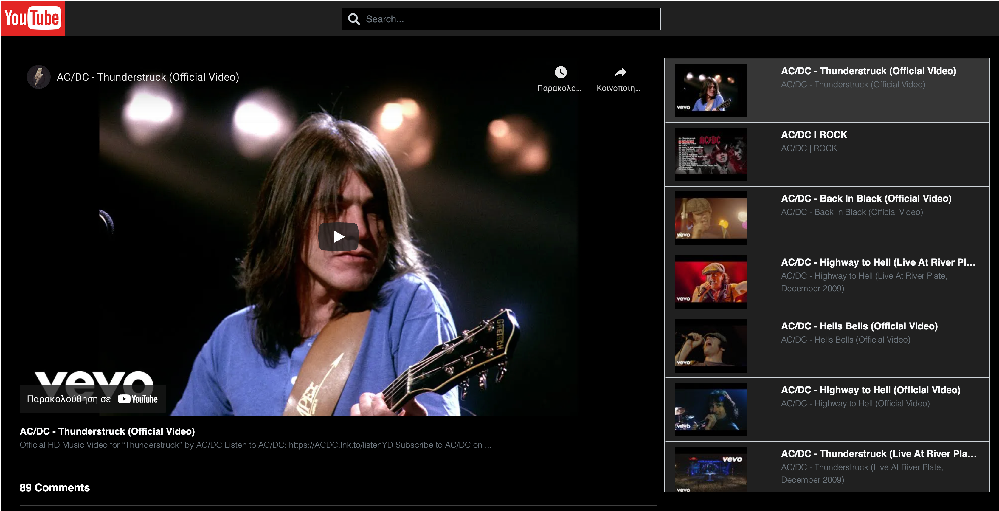

This is a test project light weight youtube viewer using Youtube API, React, Redux, Typescript

## Technologies

Project is created with:

* React: 18.1.0
* Reactstrap: 9.0.3
* Redux: 4.1.2
* Redux-Thunk: 2.4.1
* Axios: 0.27.2
* Typescript: 4.7.3

## Features
## Prerequisites

1. Add your own personal youtube API Key in constants/defaultValues.js `const API_KEY = "ADD_API_KEY_HERE";`
   you can generate one from the [Google Developer Console](https://console.developers.google.com/)

## Setup
To run this project, install it locally using yarn:

$ yarn install
$ yarn start

Runs the app in the development mode. 
Open [http://localhost:3000](http://localhost:3000) to view it in the browser.
if localhost is not working because of the https redirect try Open [http://127.0.0.1:3000](http://127.0.0.1:3000)

The page will reload if you make edits. 
You will also see any errors in the console.

## Features

* Search your favorite video from youtube
* Play selected video
* List of search videos
* Preview the comments for each selected video
* Load next page comments for selected video

## Suggestions

* Update Redux to Redux ToolKit
* Update Typescript for Redux ToolKit
* Install React Router and Separate the Videos List from Selected Video to Another Page
* Make Autocomplete Search